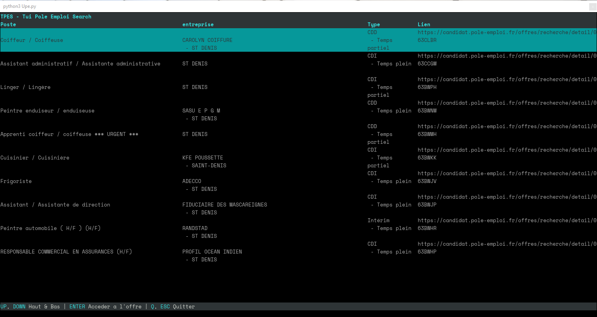

# Pe.py

> ```
>  ██████             ██████   ██   ██
> ░██░░░██  █████    ░██░░░██ ░░██ ██
> ░██  ░██ ██░░░██   ░██  ░██  ░░███
> ░██████ ░███████   ░██████    ░██
> ░██░░░  ░██░░░░  ██░██░░░     ██
> ░██     ░░██████░██░██       ██
> ░░       ░░░░░░ ░░ ░░       ░░
> ```


### DESCRIPTION

application tui ou cli pour rechercher les offres d'emploi sur pole emploi

### TODO

- recuperer l'adresse pour l'injecter dans la fonction du webbrowser
- integrer l'api pole emploi
- inserer la fonction de recherche
- export au format md (tableau)

### DEVELOPPEUR

- matthias.david.974@gmail.com

Si vous aimez les application en mode terminal, python et Urwid et que vous souhaitez participer au developpement de celle ci contactez moi. 